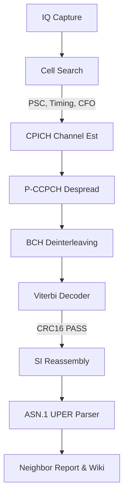
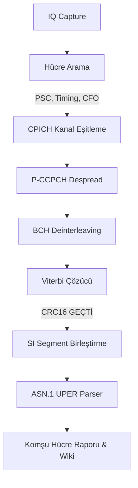

# WCDMA/UMTS Passive Neighbor Cell Decoder

[English](#english) | [Türkçe](#türkçe)

---

## English

A software-defined radio (SDR) passive WCDMA broadcast (BCH/BCCH) decoder designed to perform offline cell searching, timing alignment, frequency offset correction, convolutional decoding, and ASN.1 parsing of SIB11 and SIB19 messages to extract neighbor cell topographies (WCDMA inter-frequency and LTE inter-RAT).

### ⚠️ Important Scope Notice & Legality
This software is **strictly passive**. It only decodes public, unencrypted system information broadcast (BCH/BCCH) channels transmitted by base stations. It **does not** capture, intercept, or decrypt user traffic or identities (IMSI/TMSI/phone calls/SMS). It belongs to the same class of passive utility tools as `gr-gsm` (scanner mode) and `srsRAN` (cell search mode).

### Why this project exists
While there are robust, mature open-source solutions for 2G (`gr-gsm`) and 4G/5G (`srsRAN`), there is a distinct gap in clean, accessible tools for 3G (WCDMA/UMTS) System Information Block (SIB) decoding. This project fills that gap by providing a pure Python implementation of the physical, transport, and RRC layer protocols required to sync, decode, and parse WCDMA broadcast channels.

### Features
* **Cell Search:** Slot synchronization via P-SCH correlation, frame boundary alignment via S-SCH (circular shift matching), and Primary Scrambling Code (PSC) identification.
* **Coherent Equalization & Phase Recovery:** CPICH-guided channel estimation and compensation on the P-CCPCH channel.
* **BCH Transport Channel Decoding:** Time Tracking Loop (TTL), inter-frame de-interleaving, convolutional decoding ($R=1/2$, $K=9$) using a vectorized Viterbi decoder, and CRC16 verification.
* **RRC SI Reassembly:** SFN-aligned multi-segment system information reassembly for large System Information Blocks.
* **ASN.1 UPER Parsing:** Decode standard RRC MIB, SIB3, SIB5, SIB11, SIB11bis, and SIB19 messages using 3GPP TS 25.331 schemas.
* **FDD/TDD Separation:** Robust separation of frequency allocations to prevent TDD cell definitions from corrupting FDD allocation lists.
* **Cross-RAT Validation:** Automatically identifies consistent cell lists confirmed across independent sources (e.g. comparing WCDMA SIB11 and GSM SI2quater).

### Decoding Architecture



### Hardware Requirements
* **Tested SDRs:** LimeSDR Mini v2.0, USRP B205.
* **Supported SDRs:** Any Software Defined Radio supported by the `SoapySDR` library.
* **Frequency Range:** Must support the DL frequency bands of your target carrier (e.g. Band 1 ~2100 MHz, Band 8 ~900 MHz).

### Installation

#### Prerequisites (System Packages)
The python bindings for `SoapySDR` are usually best installed via your package manager.
On Debian/Ubuntu:
```bash
sudo apt-get install python3-soapysdr soapysdr-module-limesdr soapysdr-tools
```

#### Python Environment Setup
1. Clone the repository:
   ```bash
   git clone https://github.com/06kutay/wcdma-decoder.git
   cd wcdma-decoder
   ```
2. Create and activate a virtual environment (ensure system packages are accessible to the venv for `SoapySDR`):
   ```bash
   python3 -m venv --system-site-packages venv
   source venv/bin/activate
   ```
3. Install dependencies:
   ```bash
   pip install -r requirements.txt
   ```

### Usage

#### 1. End-to-End Scan (Recommended)
You can run a complete capture, cell search, BCH decode, and report generation in a single command using `wcdma_scan.py`:
```bash
# Scan a list of UARFCNs
python3 wcdma_scan.py --uarfcn "10813 2997" --duration 3.0 --gain 40.0

# Scan an existing IQ capture file instead of capturing live
python3 wcdma_scan.py --input captures/uarfcn_10813_long.cfile
```

#### 2. Manual Captured Analysis
If you want to run steps individually:
* **Capture IQ data:**
  ```bash
  python3 wcdma_capture.py --uarfcn 10813 --duration 3.0 --output captures/uarfcn_10813.cfile
  ```
* **Search for cells:**
  ```bash
  python3 wcdma_cellsearch.py --input captures/uarfcn_10813.cfile
  ```
* **Decode BCH transport block & SIBs:**
  ```bash
  python3 wcdma_bch_decode.py --input captures/uarfcn_10813.cfile --sc 483 --timing 20631 --cfo 2402000.0 --output captures/uarfcn_10813_sc483.bch.json
  ```
* **Generate Neighbor Report:**
  ```bash
  python3 wcdma_neighbor_report.py
  ```

### Validation Status
* **Verified Carrier:** UARFCN 10813 (Turkcell Band 1) has been verified end-to-end. SIB19 LTE neighbor frequencies (EARFCN 6400, 1651) and SIB11 WCDMA neighbors (UARFCN 2997) have been cross-validated using independent GSM SI2quater scans.
* **Status:** Experimental / Proof-of-concept. Support for other frequency bands, operators, and TDD modes is limited and untested.

### 3GPP Technical Specifications
* **TS 25.213:** Spreading and modulation (FDD)
* **TS 25.211:** Physical channels and mapping of transport channels onto physical channels (FDD)
* **TS 25.212:** Multiplexing and channel coding (FDD)
* **TS 25.331:** Radio Resource Control (RRC); Protocol specification
* **TS 25.101:** User Equipment (UE) radio transmission and reception (FDD)

### License
This project is licensed under the GPLv3 License - see the [LICENSE](LICENSE) file for details.

#### ASN.1 Specifications Licensing Exception
The ASN.1 definition files in the `wcdma_rrc_asn1/` directory are derived from 3GPP Technical Specification TS 25.331 (V17.1.0 / V16.1.0). Copyright for these definitions belongs to the 3GPP Organizational Partners (ARIB, ATIS, CCSA, ETSI, TSDSI, TTA, TTC). They are included solely for technical interoperability and protocol compliance, and are **NOT** covered by this project's GPLv3 license.

---

## Türkçe

WCDMA komşu hücre topografyasını (WCDMA inter-frequency ve LTE inter-RAT) çıkartmak amacıyla, pasif WCDMA yayını (BCH/BCCH) deşifre eden, hücre arama, zamanlama hizalaması, frekans kayması (CFO) düzeltmesi, kanal kod çözme (Viterbi) ve SIB11/SIB19 mesajlarının ASN.1 UPER kod çözümlemesini gerçekleştiren yazılım tanımlı radyo (SDR) tabanlı bir kod çözücüdür.

### ⚠️ Önemli Kapsam Notu ve Yasal Durum
Bu yazılım **tamamen pasiftir**. Yalnızca baz istasyonları tarafından şifresiz olarak yayınlanan, herkese açık sistem bilgi bloklarını (BCH/BCCH) çözümler. Kullanıcı trafiğini, kimlik bilgilerini (IMSI/TMSI) veya ses/SMS verilerini kesinlikle **dinlemez, yakalamaz veya deşifre etmez**. `gr-gsm` (tarama modu) ve `srsRAN` (hücre arama modu) ile aynı kategoride yer alan açık kaynaklı bir pasif araçtır.

### Neden bu proje geliştirildi?
2G (`gr-gsm`) ve 4G/5G (`srsRAN`) için gelişmiş açık kaynak çözümler mevcutken, 3G (WCDMA/UMTS) Sistem Bilgi Bloklarını (SIB) çözümlemek için temiz ve erişilebilir bir araç bulunmamaktaydı. Bu proje, WCDMA yayın kanalını senkronize etmek, deşifre etmek ve ayrıştırmak için gerekli olan fiziksel, taşıma ve RRC katman protokollerinin saf Python uygulamasını sunarak bu boşluğu doldurmaktadır.

### Özellikler
* **Hücre Arama (Cell Search):** P-SCH korelasyonu ile slot hizalama, S-SCH (dairesel kaydırma eşlemesi) ile çerçeve başlangıç zamanlaması tespiti ve Primary Scrambling Code (PSC) tanımlama.
* **Kanal Eşitleme ve Faz Kurtarma:** CPICH pilot kanalı kullanılarak P-CCPCH üzerinde kanal tahmini ve faz rotasyonu giderimi.
* **BCH Taşıma Kanalı Kod Çözme:** Zaman Takip Döngüsü (TTL), çerçeveler arası de-interleaving, vektörize Viterbi kod çözücü ($R=1/2$, $K=9$) ve CRC16 doğrulaması.
* **RRC SI Segment Birleştirme:** Büyük SIB'lerin birleştirilmesi için SFN hizalı çoklu segment montajı.
* **ASN.1 UPER Kod Çözme:** 3GPP TS 25.331 şeması kullanılarak RRC MIB, SIB3, SIB5, SIB11, SIB11bis ve SIB19 mesajlarının çözümlenmesi.
* **FDD/TDD Ayrımı:** TDD hücre tanımlarının FDD frekans listelerini bozmasını engellemek için geliştirilmiş frekans miras alma kontrolü.
* **Çapraz-RAT Doğrulama:** Bağımsız kaynaklar (örn. WCDMA SIB11 ve GSM SI2quater) üzerinden teyit edilmiş hücreleri otomatik olarak doğrulama.

### Kod Çözme Zinciri



### Donanım Gereksinimleri
* **Test Edilen SDR'lar:** LimeSDR Mini v2.0, USRP B205.
* **Desteklenen SDR'lar:** `SoapySDR` kütüphanesi tarafından desteklenen herhangi bir donanım.
* **Frekans Aralığı:** Hedef operatörün DL frekans bandını desteklemelidir (örn. Band 1 ~2100 MHz, Band 8 ~900 MHz).

### Kurulum

#### Sistem Paketleri (Ön Gereksinimler)
`SoapySDR` kütüphanesinin Python binding'lerinin sistem paket yöneticisi ile kurulması önerilir.
Debian/Ubuntu için:
```bash
sudo apt-get install python3-soapysdr soapysdr-module-limesdr soapysdr-tools
```

#### Python Sanal Ortam Kurulumu
1. Repoyu klonlayın:
   ```bash
   git clone https://github.com/06kutay/wcdma-decoder.git
   cd wcdma-decoder
   ```
2. Sanal ortam oluşturup aktif hale getirin (SoapySDR sistem kütüphanelerine erişim için `--system-site-packages` kullanılmalıdır):
   ```bash
   python3 -m venv --system-site-packages venv
   source venv/bin/activate
   ```
3. Bağımlılıkları kurun:
   ```bash
   pip install -r requirements.txt
   ```

### Kullanım

#### 1. Uçtan Uca Tarama (Önerilen)
Capture, hücre arama, BCH çözme ve wiki entegrasyonu adımlarını tek komutla çalıştırmak için `wcdma_scan.py` aracını kullanabilirsiniz:
```bash
# Belirli UARFCN listesini tara
python3 wcdma_scan.py --uarfcn "10813 2997" --duration 3.0 --gain 40.0

# SDR olmadan, mevcut bir IQ dosyasını analiz et
python3 wcdma_scan.py --input captures/uarfcn_10813_long.cfile
```

#### 2. Adım Adım Manuel Analiz
Adımları tek tek kontrol etmek isterseniz:
* **IQ Sinyali Kaydetme:**
  ```bash
  python3 wcdma_capture.py --uarfcn 10813 --duration 3.0 --output captures/uarfcn_10813.cfile
  ```
* **Hücre Arama:**
  ```bash
  python3 wcdma_cellsearch.py --input captures/uarfcn_10813.cfile
  ```
* **BCH ve SIB Kod Çözme:**
  ```bash
  python3 wcdma_bch_decode.py --input captures/uarfcn_10813.cfile --sc 483 --timing 20631 --cfo 2402000.0 --output captures/uarfcn_10813_sc483.bch.json
  ```
* **Komşuluk Raporu Üretme:**
  ```bash
  python3 wcdma_neighbor_report.py
  ```

### Doğrulama Durumu
* **Doğrulanan Hücre:** UARFCN 10813 (Turkcell Band 1) üzerinde uçtan uca doğrulandı. SIB19 LTE komşu frekansları (EARFCN 6400, 1651) ve SIB11 WCDMA komşuları (UARFCN 2997) bağımsız GSM SI2quater taramalarında da tespit edilerek çapraz doğrulandı.
* **Durum:** Deneysel / Proof-of-concept. Diğer operatör, frekans ve TDD kombinasyonlarındaki testler sınırlıdır.

### 3GPP Referans Standartları
* **TS 25.213:** Spreading and modulation (FDD)
* **TS 25.211:** Physical channels and mapping of transport channels onto physical channels (FDD)
* **TS 25.212:** Multiplexing and channel coding (FDD)
* **TS 25.331:** Radio Resource Control (RRC); Protocol specification
* **TS 25.101:** User Equipment (UE) radio transmission and reception (FDD)

### Lisans
Bu proje GPLv3 lisansı altında lisanslanmıştır - detaylar için [LICENSE](LICENSE) dosyasına göz atabilirsiniz.

#### ASN.1 Spesifikasyonları Lisans Muafiyeti
`wcdma_rrc_asn1/` dizini altındaki ASN.1 tanım dosyaları 3GPP Teknik Spesifikasyonu TS 25.331'den (V17.1.0 / V16.1.0) türetilmiştir. Telif hakları 3GPP Organizasyon Ortaklarına (ARIB, ATIS, CCSA, ETSI, TSDSI, TTA, TTC) aittir. Bu tanımlar yalnızca teknik birlikte çalışabilirlik sağlamak amacıyla projeye dahil edilmiş olup, projenin GPLv3 lisans **kapsamı dışındadır**.

