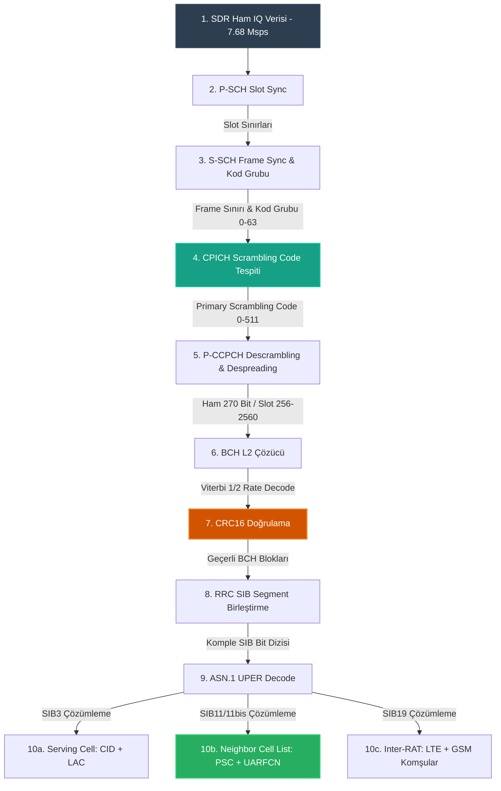

# WCDMA Decode Zinciri (Uçtan Uca Akış)

WCDMA Komşu Hücre Analizörü, bir SDR donanımı (LimeSDR Mini) vasıtasıyla havadan yakalanan ham IQ örneklerini saf Python kod bloğu (numpy/scipy) üzerinden işleyerek, RRC katmanındaki komşu hücre bilgilerine ulaşan **uçtan uca bir offline decode zinciri** uygular.

Aşağıdaki blok diyagram, ham radyo frekansı sinyalinin (IQ verisi) yazılım tabanlı adımlarla çözülerek yapılandırılmış komşu hücre listesine dönüşüm yolculuğunu göstermektedir:

---

## Decode Adımlarının Detaylı İncelemesi

### Adım 1-4: Fiziksel Katman Senkronizasyonu (Hücre Arama)
1. **LimeSDR Mini Capture:** Sinyal seçilen bant ve UARFCN değerine göre (Band 1 için LNAH, Band 8 için LNAW) 7.68 Msps hızında (2x oversampling) IQ verisi olarak diskteki bir `.bin` dosyasına kaydedilir.
2. **P-SCH Korelasyonu:** `numpy.correlate` veya FFT tabanlı filtreleme kullanılarak ham IQ dizisi $C_{psc}$ ile çarpaz ilintiye sokulur. 2560 çiplik slot sınırları bulunur. (bkz. [[concepts/P-SCH|P-SCH]])
3. **S-SCH Korelasyonu:** Slot sınırlarına göre slot başındaki ilk 256 çiplik dilimler kesilir. 16 dikgen SSC kodu ile paralel korelasyon yapılır. Çıkan 15 slotluk indeks serisi Comma-Free kod kelimeleriyle eşleştirilerek 10 ms'lik frame başlangıcı ve Scrambling Kod Grubu (0-63) bulunur. (bkz. [[concepts/S-SCH|S-SCH]])
4. **CPICH Korelasyonu:** İlgili kod grubundaki 8 scrambling kodu tek tek üretilir ve sinyal descramble edilir. Ardından CPICH OVSF kodu ile despread edilerek en yüksek tepe noktasını veren **Primary Scrambling Code (PSC)** tespit edilir. (bkz. [[concepts/CPICH|CPICH]])

### Adım 5-7: Kanal Çözme ve Kanal Kodlaması (L1/L2 Processing)
5. **P-CCPCH Despreading:** Tespit edilen PSC ve frame sınırına göre hizalanan IQ dizisinde, her slotun ilk 256 çipi atlanır, kalan 2304 çip $C_{ch,256,1}$ OVSF kodu ile çarpılarak despread edilir. Çıkan semboller QPSK demodülasyona sokularak çerçeve başına 270 ham bit elde edilir. (bkz. [[concepts/P-CCPCH|P-CCPCH]])
6. **BCH Decoding:** 20 ms'lik TTI aralığına göre iki çerçeveden gelen toplam 540 bit birleştirilir. De-interleaving yapıldıktan sonra **Viterbi algoritması** ile 1/2 rate evrişimsel kod çözülür ve 16-bit CRC dahil 262 bitlik blok elde edilir. (bkz. [[concepts/BCH|BCH]])
7. **CRC Kontrolü:** CRC16 doğrulama kodu kontrol edilir. Hata yoksa 246 bitlik RRC veri paketi bir sonraki aşamaya iletilir.

### Adım 8-10: RRC Segment Birleştirme ve ASN.1 UPER Çözümleme
8. **RRC Segment Birleştirici:** BCH kanalı üzerinden gelen RRC paketlerinin başlıklarındaki segmentasyon bilgileri incelenir. `First Segment`, `Subsequent Segment` ve `Last Segment` parçaları birleştirilerek tam bir **System Information Block (SIB)** bit dizisi elde edilir. (bkz. [[concepts/WCDMA SIB Genel|WCDMA SIB Genel]])
9. **ASN.1 UPER Decode:** `asn1tools` kütüphanesi ve 3GPP TS 25.331 ASN.1 tanım dosyası (schema) kullanılarak birleştirilmiş bit dizisi çözülür ve JSON benzeri bir Python dict objesine dönüştürülür.
10. **Bilgi Çıktıları:**
    * **Serving Cell:** [[concepts/WCDMA SIB3|SIB3]] çözülerek baz istasyonunun küresel kimliği (Cell Identity, LAC) bulunur.
    * **Komşu Hücreler:** [[concepts/WCDMA SIB11|SIB11]] ve [[concepts/WCDMA SIB11bis|SIB11bis]] çözülerek komşu 3G hücrelerin PSC ve UARFCN listeleri elde edilir.
    * **Teknolojiler Arası Komşular:** [[concepts/WCDMA SIB19|SIB19]] çözülerek LTE ve GSM komşuları listelenir.

## İlgili Konular
* [[synthesis/Sistem Mimarisi|Sistem Mimarisi]]
* [[concepts/WCDMA Cell Search|WCDMA Cell Search]]
* [[concepts/WCDMA SIB Genel|WCDMA SIB Genel]]
